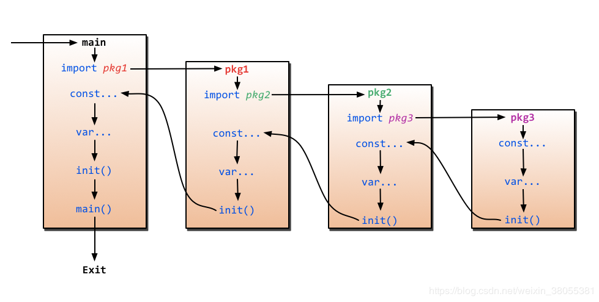

# Ch2 Hello World


在上一章中，运行了如下程序，

```go
package main

import "fmt"

func main(){
    fmt.Println("hello world!")
}
```

下面将结合此程序，进行一些简单的说明。

## 1 Go语言中的包

Go语言的代码通过包（package）组织，一个包由位于单个目录下的一个或多个.go源代码文件组成。包中的每个源文件都以一条`package`声明语句开始，在这个例子里就是`package main`，表示该文件属于哪个包。

Go的标准库提供了100多个包，以支持常见功能，如输入、输出、排序以及文本处理。比如`fmt`包，就含有格式化输出、接收输入的函数，`Println`是其中一个基础函数，可以打印以空格间隔的一个或多个值，并在最后添加一个换行符，从而输出一整行。

- `main`包比较特殊，它定义了一个独立可执行的程序，在`main`包中的`main` 函数是整个程序执行时的入口。
- 必须告诉编译器源文件需要哪些包，这就是跟随在`package`声明后面的`import`声明扮演的角色。
- 必须恰当导入需要的包，缺少了必要的包或者导入了不需要的包，程序都无法编译通过。这项严格要求避免了程序开发过程中引入未使用的包。

有个相关的工具，`goimports`，可以根据代码需要，自动地添加或删除`import`声明。这个工具并没有包含在标准的分发包中，可以用下面的命令安装：

```
$ go get golang.org/x/tools/cmd/goimports
```

## **Go语言风格**

Go语言不需要在语句或者声明的末尾添加分号，除非一行上有多条语句。

实际上，编译器会主动把特定符号后的换行符转换为分号，因此换行符添加的位置会影响Go代码的正确解析。

```html

比如行末是下列内容时，将自动把换行符转换为分号：


标识符、整数、浮点数、虚数、字符或字符串文字、关键字`break`、`continue`、`fallthrough`或`return`中的一个、运算符和分隔符`++`、`--`、`)`、`]`或`}`中的一个。

```


当换行符错误添加时，可能会导致编译不通过，例如

- 函数的左括号`{`必须和`func`函数声明在同一行上，且位于末尾，不能独占一行。
- 在表达式`x + y`中，可在`+`后换行，不能在`+`前换行


以+结尾不会被插入分号分隔符，但以x结尾则会插入分号分隔符，从而导致编译错误。


Go语言在代码格式上采取了很强硬的态度。`gofmt`工具把代码格式化为标准格式（该格式化工具没有任何可以调整代码格式的参数），并且`go`工具中的`fmt`子命令会对指定包（默认为当前目录）中所有.go源文件应用`gofmt`命令。这样可以的好处是少了争议，且便于做多种自动源码转换。很多文本编辑器都可以配置为保存文件时自动执行`gofmt`，这样源代码总会被恰当地格式化。

## **Go程序的基本结构**

下面的程序可以被顺利编译但什么都做不了，不过这很好地展示了一个 Go 程序的首选结构。这种结构并没有被强制要求，编译器也不关心 main 函数在前还是变量的声明在前，但使用统一的结构能够在从上至下阅读 Go 代码时有更好的体验。

- 包名，例如`package main`
- 在完成包的 import 之后，开始对常量、变量和类型的定义或声明。
- 如果存在**init 函数**的话，则对该函数进行定义。这是一个特殊的函数，每个含有该函数的包都会首先执行这个函数，在之后会再次提到。
- 如果当前包是 main 包，则定义 main 函数。
- 然后定义其余的函数，首先是**类型的方法**，接着是按照 main 函数中先后调用的顺序来定义相关函数，如果有很多函数，则可以按照字母顺序来进行排序。

```go
package main

import (
   "fmt"
)

const c = "C"

var v int = 5

type T struct{}

func init() { // initialization of package
}

func main() {
   var a int
   Func1()
   // ...
   fmt.Println(a)
}

func (t T) Method1() {
   //...
}

func Func1() { // exported function Func1
   //...
}
```

Go 程序的执行（程序启动）顺序如下：

1. 按顺序导入所有被 main 包引用的其它包，然后在每个包中执行如下流程：
2. 如果该包又导入了其它的包，则从第一步开始递归执行，但是每个包只会被导入一次。
3. 在每个包中初始化常量和变量，如果该包含有 init 函数的话，则调用该函数。
4. 在完成这一切之后，main 也执行同样的过程，最后调用 main 函数开始执行程序。


