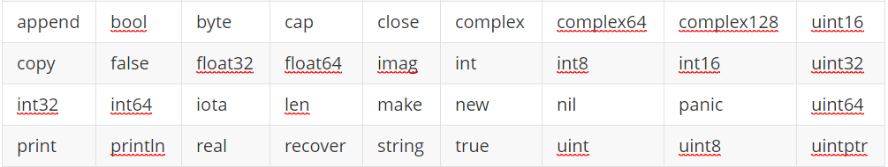

# Ch3 标识符与关键字


## **1 标识符及命名规范**

在编程语言中标识符是程序员定义的具有特殊意义的词，比如变量名、常量名、函数名等。

命名规范：

- 推荐使用驼峰式命名
- 大小写敏感，heapSort和Heapsort不同
- Go语言中标识符由字母数字和`_`(下划线）组成，并且只能以字母和`_`开头。 举几个例子：`abc`, `_`, `_123`, `a123`。


## **2 关键字与保留字**

关键字是指编程语言中预先定义好的具有特殊含义的标识符。 关键字和保留字都不建议用作变量名。

Go语言中有25个关键字：

```
    break        default      func         interface    select
    case         defer        go           map          struct
    chan         else         goto         package      switch
    const        fallthrough  if           range        type
    continue     for          import       return       var
```

关键字少，是为了简化在编译过程第一步中的代码解析。

此外，Go语言中还有30多个保留字，比如,int和true等，主要对应内建的常量、类型和函数这些内部预定义的名字并不是关键字，可以在定义中重新使用，但应尽量避免重定义，一面影起语义混乱。

```
Constants:
            true  false  iota  nil

Types:
            int  int8  int16  int32  int64
            uint  uint8  uint16  uint32  uint64  uintptr
            float32  float64  complex128  complex64
            bool  byte  rune  string  error

Functions:
            make  len  cap  new  append  copy  close  delete
            complex  real  imag  panic  recover
```


https://www.liwenzhou.com/posts/Go/01_var_and_const/

https://topgoer.cn/docs/gopl-zh/gopl-zh-1d2a07a5bc4o0


对于保留字的说法，在别处看到了不同的描述，摘录于此。

除了以上介绍的这些关键字，Go 语言还有 36 个预定义标识符，其中包含了基本类型的名称和一些基本的内置函数。




https://github.com/unknwon/the-way-to-go_ZH_CN/blob/master/eBook/04.1.md


