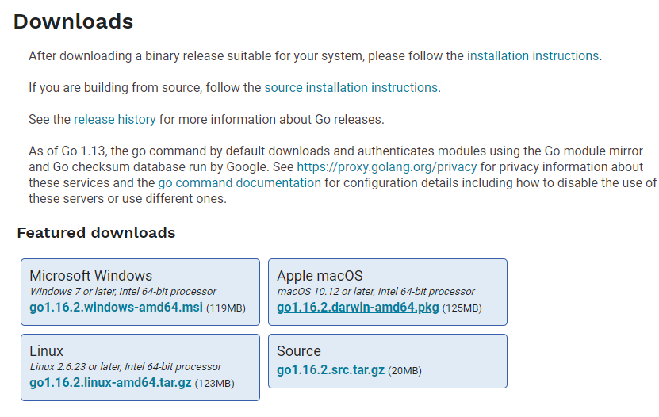

# ch1 安装与环境配置


## 1 下载

下载地址：`https://golang.google.cn/dl/`

根据环境，下载所需版本




## 2 配置环境变量

**GOROOT**

- GOROOT表示Go语言的安装目录，将GOROOT的值设置为对应的安装目录。
- 此外，`GOROOT/bin`则包含GO提供的工具链，应将`GOROOT/bin`配置到环境变量PATH中，从而能够在全局中使用GO工具链。

**GOPATH**

- Go1.8版本之前，`GOPATH`环境变量默认是空的，从Go1.8版本之后，Go开发包会在安装完成之后为`GOPATH`设置一个默认目录，如果是windows系统，打开环境变量可看到默认目录，如有需要可进行修改。
- 在Go较老的版本中，除了Go的SDK外，所有代码都推荐放置在`GOPATH`目录下。此时`GOROOT`和`GOPATH`分别指向系统安装路径和工作路径，这样的好处是自己编写的代码与系统文件分离。
- 在Go1.11版本中推出了`Go Modules`，使用`Go Module`模式以后可以不用将代码放置在`$GOPATH/src`下了。
- 在较新的版本中，会自动启用`Go Module`模式，可通过输入`go env -w GO111MODULE=off`关闭，或者输入`go env -w GO111MODULE=on` 开启

配置完环境变量后，打开终端输入`go version`，若看到输出go的版本信息则证明配置成功。


## 3 Go PATH 与 Go Module


由于Go PATH的局限性，该模式几乎已不再使用


在进行Go语言开发的时候，代码总是会保存在`$GOPATH/src`目录下。在工程经过`go build`、`go install`或`go get`等指令后之后，

- 会将下载的第三方包源代码文件放在`$GOPATH/src`目录下
- 产生的二进制可执行文件放在 `$GOPATH/bin`目录下
- 生成的中间缓存文件会被保存在 `$GOPATH/pkg` 下。

如果使用版本管理工具（Version Control System，VCS。常用如Git）来管理项目代码，只需要添加`$GOPATH/src`目录的源代码即可。`bin` 和 `pkg` 目录的内容无需进行版本控制。

但在Go1.11引入Go Modules之后，代码不必强制放置在`$GOPATH/src`下了，可以是任意一个文件夹。

关于Go的相关命令的更多信息请参考[Go依赖管理](http://zchaoyu1126.github.io/posts/go-%E4%BE%9D%E8%B5%96%E7%AE%A1%E7%90%86/)


## 4 Hello World程序

```powershell
E:
mkdir workspace_go
cd workspace_go
mkdir helloworld
cd helloworld
// helloword是这个模块的名字，可任意指定
go mod init helloworld
go mod tidy
```

新建main.go文件，并输入以下内容

```go
package main

import "fmt"

func main() {
	fmt.Println("hello world")
}
```

回到终端，输入以下命令执行

```powershell
go build main.go
main.exe

// 或者
go run main.go
```

关于Go的相关命令的更多信息请参考[Go指令](http://zchaoyu1126.github.io/posts/go-%E6%8C%87%E4%BB%A4%E9%9B%86/)


## **5 VS Code安装与使用**

1. 下载VS Code，应用商店搜索chinese，安装汉化包插件，应用商店搜索go，安装插件。

2. 打开目标文件夹，新建main.go文件，执行`go mod init modlueName`和`go mod tidy` ，modlueName是指这个模块的名字，可任意输入。在main.go中输入以下代码

   ```go
   package main
   
   import "fmt"
   
   func main() {
       fmt.Println("hello world!")
   }
   ```

3. 右键main.go 在终端中打开，终端选择cmd，输入`go build`或`go run`指令。

    
    若在vscode打开的终端内，提示没有找到该命令。
    右键->属性->兼容性->管理员身份运行，原因
    原因：配置了系统变量，而不是用户变量，所以需要管理员权限。
    

4. 插件的安装：在使用vscode的过程中会不断提示下载插件，一般都很难下载成功。此时需要设置代理，打开终端输入`go env -w GOPROXY=https://goproxy.cn,direct` ，然后再去下载。

​	
